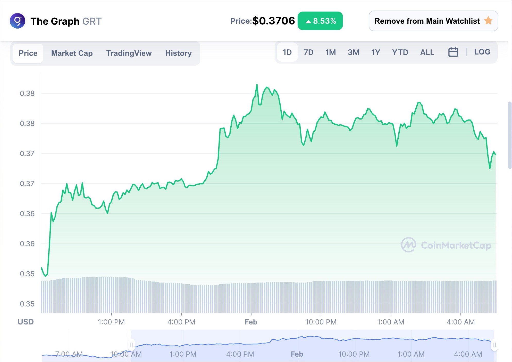

New blog who dis?... Welcome! Restructuring the old [Asialakay.net](https://www.asialakay.net/) blog and the old blog you knew is no longer. Look forward to article to be posted here and for the event calender to re-emerge at some point this Spring 2022. But as for me and this blog, you can expect to read about all things related to what I learned today. 

So, today I learned, or TIL, about The Graph, a Blockchain data indexing Protocol, or in other words a blockchain data filing system. Despite the lack of sexiness contained in the string of words "Blockchain Data Indexing Protocol" it has a use case that with potential to unite and maintain a decentralized web 3.0 economy in many ways.

You many or many not find what I write to be interesting but I will do my best to keep it to myself if I myself don't find it interesting, useful, or not widely known.

For example, this blog is built with a frontend framework called [Gatsby](https://www.gatsbyjs.com/). But a lesser known fact is that the engine that powers Gatsby sites is a tool called [The GraphQL](https://www.gatsbyjs.com/docs/why-gatsby-uses-graphql/). This tool, lets you create static web pages and React components programatically. It is also an alternative to using REST for creating and consuming APIs. The benefits of the GraphQL is that it makes it easier to access and manage endpoints, kind of like latitude and longitude for data. 

But wait... There's more.

Let's talk about The Graph, it's a Blockchain data indexing Protocol, or blockchain data filing system, and it is contributing to the web 3.0 economy in many ways. While many are getting familiar with web 3.0 through Blockchains like Bitcoin and Etherium and their respective currencies Bitcoin and Eth. While The Graph is not a blockchain, it does have a native currency, GRT. This technology and currency offers opportunities to make money with a system of built-in jobs and roles that create utility and add value by providing quality information and by rewarding the providers and maintainers of that quality information. 

I understand it like this oversimplified library analogy: 

- The Graph Protocol is like a library's Dewey decimal system
- GraphQL API subgraphs are like Google searches of  browsable Blockchain data, or the library aisles organized by category
- [Curators, Delegators, Indexers and Developers](https://thegraph.com/docs/en/#network-roles) are like the librarians, investors, facilities crew and authors that organizes create, maintains, funds and distribute your favorite Blockchain data, NFT's, whos-it's and whats-its galore.





- [GRT Token](https://coinmarketcap.com/currencies/the-graph/) is the currency that keeps the lights on, pays the creators, crew and librarians and is invested by the investors. 


Learn & Earn, The Graph [@CoinMarketCap.com](https://coinmarketcap.com/earn/project/the-graph)

For a detailed look into how people are using the Graph protocol, GraphQL, and GRT, check out this [medium article by Coinmonks](https://medium.com/coinmonks/what-you-need-to-know-about-the-graph-grt-b2c3de67450f). 

Interact with the Graph community through: 

[Reddit](https://www.reddit.com/r/thegraph/)
[Discord](https://discord.com/invite/vtvv7FP)
[Telegram](https://t.me/graphprotocol)


<!-- You can also write code blocks here!

```js
const saltyDuckEgg = "chinese preserved food product"
```

| Number | Title                                    | Year |
| :----- | :--------------------------------------- | ---: |
| 1      | Harry Potter and the Philosopher’s Stone | 2001 |
| 2      | Harry Potter and the Chamber of Secrets  | 2002 |
| 3      | Harry Potter and the Prisoner of Azkaban | 2004 |

[View raw (TEST.md)](https://raw.github.com/adamschwartz/github-markdown-kitchen-sink/master/README.md)

This is a paragraph.

    This is a paragraph.

# Header 1

## Header 2

    Header 1
    ========

    Header 2
    --------

# Header 1

## Header 2

### Header 3

#### Header 4

##### Header 5

###### Header 6

    # Header 1
    ## Header 2
    ### Header 3
    #### Header 4
    ##### Header 5
    ###### Header 6

# Header 1

## Header 2

### Header 3

#### Header 4

##### Header 5

###### Header 6

    # Header 1 #
    ## Header 2 ##
    ### Header 3 ###
    #### Header 4 ####
    ##### Header 5 #####
    ###### Header 6 ######

> Lorem ipsum dolor sit amet, consectetuer adipiscing elit. Aliquam hendrerit mi posuere lectus. Vestibulum enim wisi, viverra nec, fringilla in, laoreet vitae, risus.

    > Lorem ipsum dolor sit amet, consectetuer adipiscing elit. Aliquam hendrerit mi posuere lectus. Vestibulum enim wisi, viverra nec, fringilla in, laoreet vitae, risus.

> ## This is a header.
>
> 1. This is the first list item.
> 2. This is the second list item.
>
> Here's some example code:
>
>     Markdown.generate();

    > ## This is a header.
    > 1. This is the first list item.
    > 2. This is the second list item.
    >
    > Here's some example code:
    >
    >     Markdown.generate();

- Red
- Green
- Blue

* Red
* Green
* Blue

- Red
- Green
- Blue

```markdown
- Red
- Green
- Blue

* Red
* Green
* Blue

- Red
- Green
- Blue
```

- `code goes` here in this line
- **bold** goes here

```markdown
- `code goes` here in this line
- **bold** goes here
```

1. Buy flour and salt
1. Mix together with water
1. Bake

```markdown
1. Buy flour and salt
1. Mix together with water
1. Bake
```

1. `code goes` here in this line
1. **bold** goes here

```markdown
1. `code goes` here in this line
1. **bold** goes here
```

Paragraph:

    Code

<!-- -->

   <!--  Paragraph:

        Code

---

---

---

---

---

    * * *

    ***

    *****

    - - -

    ---------------------------------------

This is [an example](http://example.com "Example") link.

[This link](http://example.com) has no title attr.

This is [an example][id] reference-style link.

[id]: http://example.com "Optional Title"

    This is [an example](http://example.com "Example") link.

    [This link](http://example.com) has no title attr.

    This is [an example] [id] reference-style link.

    [id]: http://example.com "Optional Title"

_single asterisks_

_single underscores_

**double asterisks**

**double underscores**

    *single asterisks*

    _single underscores_

    **double asterisks**

    __double underscores__

This paragraph has some `code` in it.

    This paragraph has some `code` in it.


    
 -->